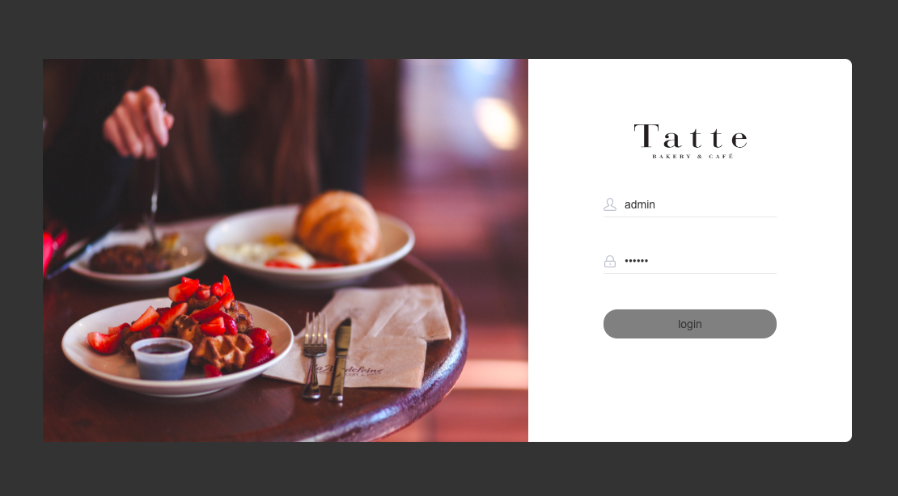

## Project Preview

## Technologies Used
- SpringBoot
- MySql
- Mybatis Plus
- Redis

## Project Modules
- 🔺Backend
  - [x] Login module
  - [x] Employee management
  - [x] Category management
  - [x] Dish (food item) management
  - [x] Combo (set meal) management
  - [x] Order management
- 🔻Frontend
  - [x] User module 
  - [x] Shopping cart module 
  - [x] Address module 
  - [x] Order module 
  - [x] Dish module

## Project Deployment

1. Download this project to the server.

2. Modify the src/main/resources/application.yml file with the database information.
> For V1, you need to change the following:
  - Database name
  - Database username
  - Database password
> For V2, you also need to add Redis configuration information.
1. When deploying the project on the server, package the project into a jar file and run it using java -jar package_name.

2. Access the backend: localhost:8080/backend/page/login.html

3. Access the frontend: localhost:8080/front/page/login.html

